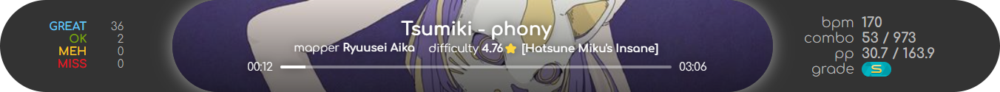
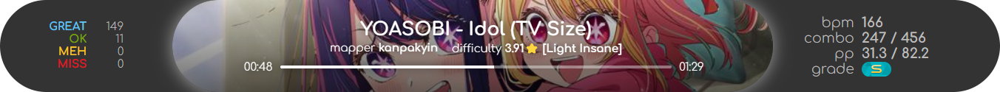
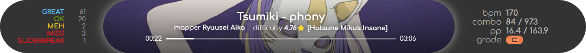
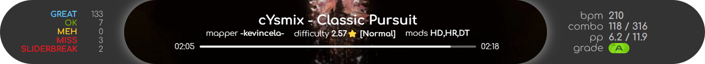
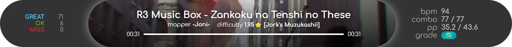
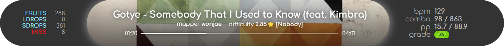
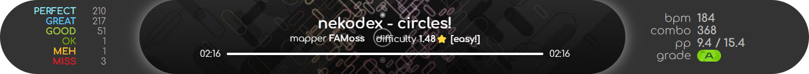
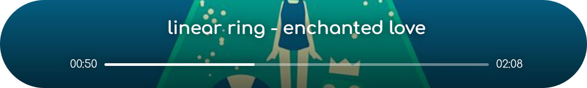
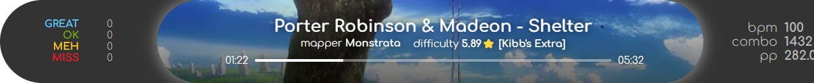

# LNN 的 osu! 歌曲信息和 pp 显示 LNN’s osu! song info and pp display

适用于 [osu!StreamCompanion] 的 *web overlay*，修改自 osu!StreamCompanion 自带的示例 [SC_Map Example]，可用于 OBS 浏览器源 
A *web overlay* for [osu!StreamCompanion], modified from osu!StreamCompanion’s built-in [SC_Map Example], can be used as OBS browser source

[osu!StreamCompanion]: https://github.com/Piotrekol/StreamCompanion
[SC_Map Example]: https://github.com/Piotrekol/StreamCompanion-overlays/tree/701a486ecf44e8f367ea2e848ba2fe92aad92d09/overlays/SC_Map%20Example

## 安装 Installing

使用前需要安装并启动 [osu!StreamCompanion]，将本仓库置于其安装目录内的 `Files/Web/overlays` 文件夹中，然后点击 osu!StreamCompanion 的 ![[两个小圆圈]][wo] 按钮，在打开的页面中即可找到本布局。 
To use, install and launch [osu!StreamCompanion], place this repository inside the `Files/Web/overlays` folder in its install directory, and then click on the ![[two small circles]][wo] button in osu!StreamCompanion. You can then find this layout in the page that opens.

[wo]: images/_weboverlaybtn.png "Web overlays"

## 功能 Features

听音乐时除了歌名、曲师、谱师、难度，右侧还会显示**实时 BPM**、**最高连击数**和**无 mod 最高 pp** 
When listening, shows song title, artist, mapper, difficulty, along with **real-time BPM**, **max combo**, and **max pp without mods** on the right

游玩、观看回放和在结算界面时，会在左侧显示**判定统计**，右侧还会增加**当前最大连击数**、**实时 pp**（斜杠前的数字）和**实时评级** 
When playing, watching a replay or on a result screen, shows **statistics** on the left, and adds **current max combo**, **real-time pp** (the numbers before the slashes) and **real-time grade** on the right

只要能确定当前 sliderbreak 数量，且不为 0，就会在左侧显示具体数量，尽管有些情况\*下无法确定 
Whenever the current number of sliderbreaks can be determined AND is not zero, shows the count on the left. In some situations\* it can't be determined, though

*&#32;查看过往成绩的结算界面而未播放回放时 
*&#32;i.e. checking the result screen of a past play without watching replay

另外，歌名、曲师名含有非英文字符时，每隔几秒会自动在转写与原文之间切换 
In addition, when song title and/or artist name contains non-English characters, switches automatically between transliteration and original text every few seconds

**2024-07-07 新增**：现在歌名和曲师名较长时会滚动显示 
**New 2024-07-07**: Now song title and artist name will scroll if too long

https://github.com/DGCK81LNN/lnn_osu_overlay/assets/54282183/2acac0d9-7722-48d7-9672-8ddf2bbc8992

如果有 mods 开启则无论是否在游玩都会显示 
If mods are enabled they will be shown whether you're playing or not

（另外，若启用了 Relax、Autopilot、Auto 或 Cinema 游玩，右侧会显示“娱乐模式，不计分”或“自动演示，不计分”字样。您可在 `main.js` 中修改 `showAutomationNotice` 属性为 `false` 来禁用这一功能。） 
(In addition, when playing with Relax, Autopilot, Auto or Cinema on, a notice will show on the right that says “relax mode, unranked” or “autoplay, unranked” (currently in Chinese always). To turn off this feature, set the `showAutomationNotice` property to `false` in `main.js`.)

支持四种游戏模式 
Supports all four game modes

  * taiko 
    
  * catch 
    
  * mania 
    

*&#32;mania 模式不显示最大连击数，因为不知道 
*&#32;map max combo is not shown for mania because program doesn't know

### 音乐播放器模式 Music player mode

在此模式下，只显示歌名和曲师，且您可以自由调整窗口宽度。 
In this mode, only song title and artist are  displayed, and you can adjust the viewport width freely.

要进入此模式，只需在 URL 后加上 `#musiconly`，如 `http://localhost:20727/overlays/lnn_osu_overlay/#musiconly` 
To enter this mode, simply add `#musiconly` to the end of the page URL, for example `http://localhost:20727/overlays/lnn_osu_overlay/#musiconly`

## 注意事项 Note

  * 虽然本布局的样式看起来很像 osu!(lazer)，但是截至本仓库发布时，osu!StreamCompanion 只适用于 osu! stable 版。 
    Although this layout has a very osu!(lazer)-ish style, osu!StreamCompanion can only be used with osu! stable by the time this repository is published.

  * 本布局的高度为 100 像素，宽度根据窗口大小自动调节，建议在 1333 像素以上。要调整大小，建议使用自定义 CSS 实现（窗口大小也需要同比例调节），以放大到 1.25 倍为例： 
    This layout has a height of 100px and a flexible width depending on viewport — I recommend no less than 1333px. To adjust the size, custom CSS is recommended (multilpy the viewport size by the same ratio). Take zooming in to 1.25x for example:

    ~~~css
    :root { zoom: 1.25 }
    ~~~

    此时窗口高度就需要调整到 125 像素，建议宽度在 1333 × 1.25 ≈ 1667 像素以上。如果窗口宽度太窄，右边会显示不全被裁切掉。 
    Now the viewport height should be adjusted to 125px, and the minimum recommended width will be 1333 × 1.25 ≈ 1667. If the viewport width is far too small, the right side will be clipped.

    

    不过，在音乐播放器模式下您可以适当地调小窗口宽度而不会出现显示不全的情况。建议宽度在 720 像素左右，但没有硬性限制。 
    In music player mode, however, you can decrease the viewport width without the right side ever being clipped. I recommend around 720px in this case, but there is no hard limit.

## 已知问题 Known issues

  * CTB 模式下处于结算屏幕时评级总会变成 D 
    When in results screen in CTB, grade always becomes D

  * ~~标题显示不下的时候只会省略号，暂时不会滚动显示~~ 2024-07-07 已添加滚动功能 
    ~~When title is too long to fit in one line, it is ellipsized for now, instead of scrolled horizontally to show the full line~~ Scroll feature added on 2024-07-07

  * mods 开启时，显示的最高 pp 仍然是无 mods 的 
    When mods are on, max pp is still max pp without mods
